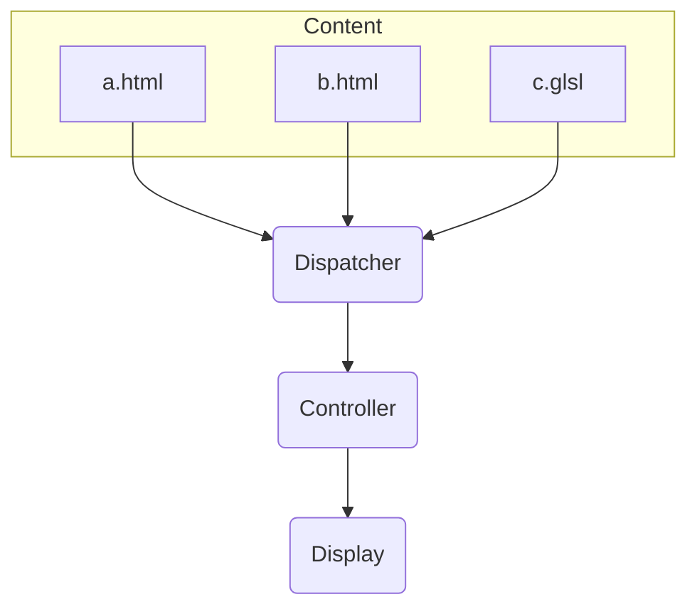

# Website

Currently uses a custom framework I made, the general architecture looks like this:

> **Note** This is a very early representation, so it may become subject to change



Although it looks similar to MVC pattern at first sight, it's different in few ways:

- Dispatcher is not a "Model". It doesn't care about the shape or the structure of the data/content. It only knows where to find it and how to load it.
- Controller manages the main logic & context, it owns GLController and SiteContext:

  ```mermaid
  flowchart TB
    subgraph Controller
      ctx(SiteContext)
      subgraph WebGL Interface
        glc(GLController)
        gla(GLAnimation)
        gld(GLData Object)

        gla---glc
        gld---glc
      end
    end
  ```

- Display is responsible with handling what to show on the screen; content & effects etc.
